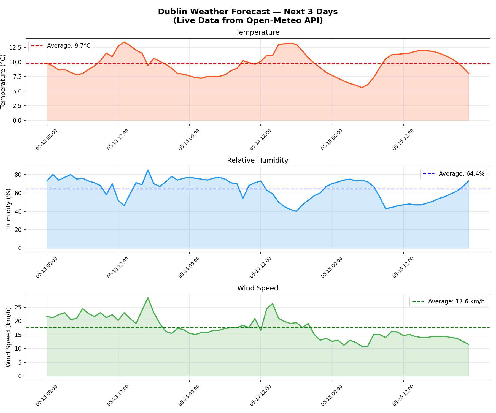

# 🌤️ Dublin Weather Analyser

A Python tool that fetches **live real-time weather data** 
for Dublin, Ireland using the free Open-Meteo API and 
generates professional forecast charts.

No API key needed — works straight away!

## What it does
- Fetches live 72-hour weather forecast for Dublin
- Analyses temperature, humidity and wind speed
- Plots 3 professional charts with average lines
- Prints a clean summary table to the terminal
- Saves charts as PNG for reports and portfolios

## How to run

```bash
# Install dependencies
pip3 install requests numpy matplotlib

# Run the analyser
python3 weather_analyser.py
```

## Output



## Sample Output
